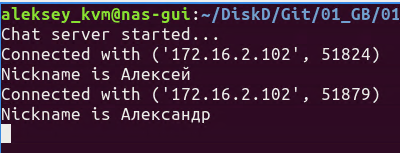

# Компьютерные сети
## Домашняя работа 6
* **
### Автор:
Деревянных Алексей
* **

#### Условие задачи:
1. Напишите свою программу сервер и запустите её. (если опыта в python нет, запустите готовый код и разберитесь, как он работает - файл с кодом готового клиента: https://disk.yandex.ru/d/cAfsjjG_mLqF3A файл с кодом готового сервера: https://disk.yandex.ru/d/qrj4qpiXhXVwgw )

2. ** попробуйте улучшить код, опишите что сделали, какие фичи добавили.
3. Запустите несколько клиентов. Сымитируйте чат.
4. Отправьте мне код написанного сервера (можете через github, если удобно или прямо здесь в txt формате) и скриншоты работающего чата.
5. Отследите сокеты с помощью команды netstat. (тоже пришлите скриншот именно сокетов вашего чата)
6. Перехватите трафик своего чата в Wireshark и cшейте сессию. Пришлите скриншот сшитой сессии с диалогом.


### Описание работы
В файлах __*server.py*__ и __*client.py*__ заменил кодировку *ascii* на *utf8* для корректной работы чата на разных языках.
Также добавил проверку исключений при отправке сообщения клиентом в файле __*client.py*__
```` python
def write():
    while True:
        message = '{}: {}'.format(nickname, input(''))
        try:
            client.send(message.encode('utf8'))
        except:
            print('Error sending message!')
            client.close()
````
Запускаем сервер на отдельном ПК внутри локальной сети. Затем запускаем двух клиентов с одного ПК.

Вывод в терминале первого клиента, видим сообщение от второго клиента:


Вывод в терминале второго клиента:


Вывод в терминале сервера, видим обоих подключённых клинтов:



Проверяем открытые соккеты на сервере, видим там подключения от обоих клиентов.
Видим, что IP клиентов один, а порты разные, т.к. оба клиента запускаются с одного ПК:


Проверяем открытые соккеты на стороне клиентов, видим подключения обоих клиентов к серверу:


Перехватываем трафик чата в Wireshark, видим диалог из чата:

